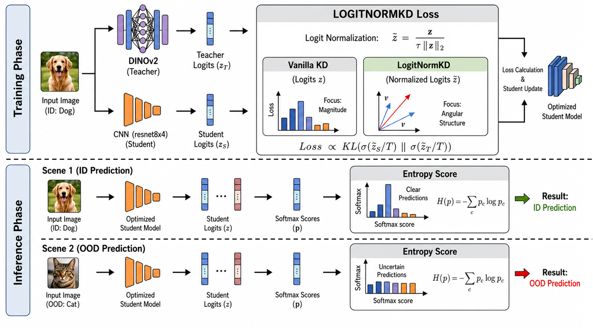
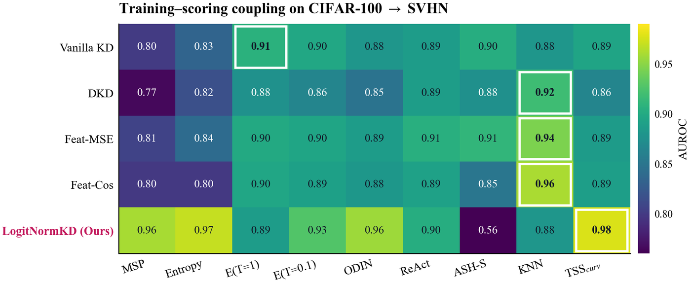
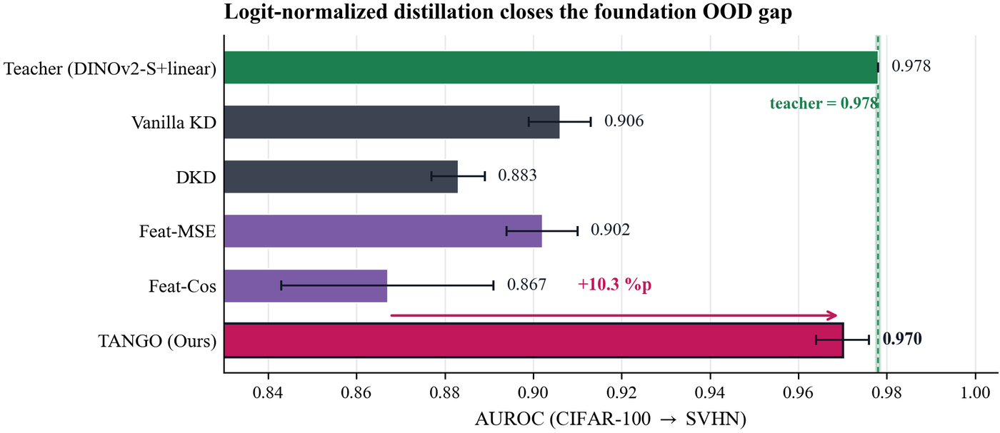

# TANGO: Logit-Normalized Distillation Preserves OOD Ability in Foundation Models and Reshapes Which Scores Work

**BMVC 2026** · Yeongje Park, Eui Chul Lee (Sangmyung University)

Foundation models such as DINOv2 and CLIP are strong out-of-distribution (OOD)
detectors out of the box, but distilling them into a small CNN breaks that
ability: vanilla KD, DKD and feature-distillation baselines all lose 7–11 %p of
far-OOD AUROC even while ID accuracy is preserved.

**TANGO** closes that gap with a one-line change to the loss and no inference
overhead: L2-normalize both teacher and student logits inside the KD objective,
then score with predictive entropy.

```python
z_tilde = z / (tau * z.norm(dim=1, keepdim=True))     # tau = 0.04, training only
loss = ce(z_tilde_s, y) + T**2 * kl(softmax(z_tilde_t / T), softmax(z_tilde_s / T))
```



Normalization is applied **during training only** — at inference the student is
scored on raw logits, so deployment cost is identical to a standard classifier.

## Quickstart

```bash
pip install -r requirements.txt

# Evaluate a released TANGO student. Datasets download on first run.
python eval_ood.py --checkpoint checkpoints/cifar100_resnet8x4/logitnormkd_seed0.pt
```

```text
mean ||z||_2 on ID = 1.34   (paper: ~1.3 for LogitNormKD, ~31 for vanilla KD)

OOD                     entropy          energy_t1
--------------------------------------------------
svhn               0.9777/0.105       0.1131/0.999
```

Now run the same command on the vanilla-KD baseline:

```bash
python eval_ood.py --checkpoint checkpoints/cifar100_resnet8x4/vanillakd_seed0.pt --ood svhn
```

| student (seed 0) | mean ‖z‖ | Entropy | Energy@T=1 |
|---|---|---|---|
| vanilla KD | ~31 | 0.839 | **0.907** |
| **TANGO** | **~1.3** | **0.978** | 0.113 ← inverted |

That is the whole paper in one table. TANGO compresses the logit magnitude ~30×,
which moves the OOD signal off the magnitude axis and onto softmax shape.
Entropy reads shape and wins; Energy reads magnitude and collapses — on this seed
it inverts outright (AUROC < 0.5 = the ID/OOD ordering flipped). `eval_ood.py`
reports AUROC **raw**, so inversions stay visible instead of being hidden by
orientation correction.

## Train from scratch

```bash
python train.py --method logitnormkd --seed 0     # TANGO
python train.py --method vanillakd   --seed 0     # baseline
```

Defaults match `configs/cifar100_*_seed*.yaml` exactly: 100 epochs SGD, lr 0.05,
multistep [60, 80, 90] × 0.1, weight decay 5e-4, momentum 0.9, batch 64;
LogitNormKD `T=4, tau=0.04, ce_w=kd_w=1`; vanilla KD `T=4, alpha=0.1, beta=9`.
The teacher is a frozen `facebook/dinov2-small` plus the released linear probe in
`checkpoints/teacher_heads/` (needs `transformers`; ~90 MB one-time download).
About 90 min/seed on one RTX 4080.

```bash
# 2-epoch smoke test
python train.py --method logitnormkd --epochs 2 --limit-batches 5
```

## Why it works, and why the usual scores stop working

Removing the incentive to encode confidence in logit magnitude compresses ‖z‖ by
about 30× (31 → 1.3). The OOD signal does not disappear; it moves off the
magnitude axis and onto the *shape* of the softmax. One mechanism explains both
the gain and an otherwise puzzling side effect: scores that read magnitude get
worse on exactly the students that detect OOD better.



Going from vanilla KD to TANGO on the CIFAR-100 far-OOD suite:

| score reads | detector | change |
|---|---|---|
| softmax shape | MSP / Entropy / MaxLogit | **+0.124 / +0.107 / +0.045** |
| layer statistics | GRAM / RMDS | +0.002 / +0.018 |
| magnitude, features | KNN / MDSEns / Energy / MDS / ViM | −0.044 / −0.160 / −0.171 / −0.266 / −0.452 |

Entropy is therefore not an arbitrary choice — it is the simplest score that
reads the channel the training objective moved the signal into.

The gradient argument behind the compression is checkable in three lines:

```python
import torch; from tango import logit_norm
z = torch.randn(4, 100, requires_grad=True)
logit_norm(z, 0.04).sum().backward()
(z.grad * z).sum(1).abs().max()        # ~1e-7: the gradient is orthogonal to z
```

## Results

**CIFAR-100 → far-OOD** (resnet8x4 student, 1.2 M params, DINOv2-S teacher, 3 seeds).
far₄ = mean of MNIST/SVHN/DTD/Places365, Entropy-scored for every row.

| method | ID acc | SVHN | far₄ |
|---|---|---|---|
| Teacher (frozen DINOv2-S + linear) | 0.830 | 0.978 | 0.806 |
| Vanilla KD | 0.733 | 0.906 | 0.727 |
| DKD | 0.728 | 0.883 | 0.725 |
| Feat-MSE | 0.748 | 0.902 | 0.752 |
| Cosine-Feat | 0.730 | 0.867 | 0.748 |
| LogitNorm-CE (no teacher) | 0.736 | 0.907 | 0.767 |
| ELogitNorm-CE (no teacher) | 0.734 | 0.942 | 0.792 |
| **TANGO** | **0.771** | **0.970** | **0.834** |



**ImageNet-1K** (ResNet18 student, OpenOOD large-scale protocol, single runs).
Far-OOD = iNaturalist/Textures/OpenImage-O.

| method | ID acc | far Entropy | far Energy |
|---|---|---|---|
| Teacher (frozen) | 0.799 | 0.905 | 0.940 |
| Vanilla KD | 0.676 | 0.794 | **0.873** |
| **TANGO** | 0.675 | **0.880** | 0.220 |

At ImageNet scale magnitude-based scoring is genuinely strong — vanilla KD's best
score is Energy — yet the fixed Entropy readout still leads, with no score
selection. TANGO's own Energy inverts (0.220), the same magnitude-versus-shape
signature, now deterministic rather than seed-dependent.

TANGO also holds on CIFAR-10 ID (far₄ 0.947 vs 0.918 for the best baseline),
ImageNet-200, ImageNet-100, a wrn\_40\_2 student, and CLIP and DINOv2-B teachers.
Near-OOD is an explicit trade-off, not an oversight: the ‖z‖ compression that
recovers far-OOD discards class-confidence cues, costing 6–7 %p on
CIFAR-100 → CIFAR-10.

## Layout

```text
tango/
  logitnorm_kd.py   the method: LogitNormKD (and the vanilla-KD baseline)
  scores.py         Entropy / Energy / MSP / MaxLogit + AUROC, FPR@95
  resnet.py         resnet8x4 student
  teacher.py        frozen DINOv2 + released linear probe
  data.py           CIFAR-100 ID and OOD loaders, paper preprocessing
train.py            training entry
eval_ood.py         evaluation entry
configs/            the exact configs behind the released checkpoints
checkpoints/        resnet8x4 students (TANGO and vanilla KD, 3 seeds each),
                    two ImageNet-1K ResNet18 students, teacher linear probes
```

## Notes for reproduction

- **Preprocessing matters.** OOD images are resized to 32×32 and normalized with
  the **ID** dataset's statistics. Changing the constants in `tango/data.py`
  changes the numbers.
- **Orientation.** `eval_ood.py` reports AUROC without orientation correction, so
  a value below 0.5 means the ranking inverted. The paper's Tab. 1 and Fig. 3
  orient each (method, score) pair empirically; supp. Tab. 20 reports raw. TANGO
  + Energy is where this matters.
- **Seeds.** Released checkpoints are individual seeds; the paper's tables are
  3-seed means. TANGO's Energy on CIFAR-100 → SVHN inverts on seed 0 and not on
  seeds 1–2 — itself a symptom of the collapsed magnitude axis.
- **NINCO.** For ImageNet, load `NINCO/NINCO_OOD_classes` (5,878 images). A
  recursive glob over the NINCO release also picks up
  `popular_datasets_subsamples` and inflates near-OOD by several points.
- **Manual OOD splits.** `svhn`, `cifar10`, `mnist`, `dtd` download automatically.
  `tin`, `places365`, `lsun_c` need a local copy; see the docstring in
  `tango/data.py` for the expected layout.
- **MDSEns** (in the detector table above) uses equal ensemble weights. OpenOOD's
  `alpha_selector` fits them by logistic regression on ID-vs-OOD validation data,
  which leaks OOD information into the detector.
